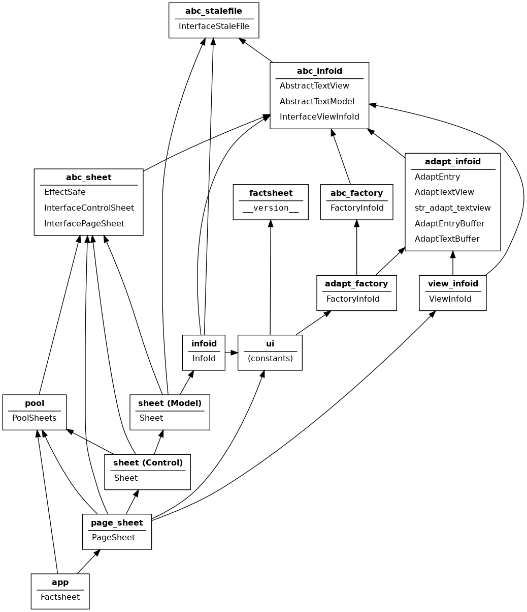

Design Notes (Draft)
====================

Factsheet evolved by exploration and refactoring. These notes capture
design decisions made along the way. The notes are *ad hoc* since they
were written after the fact. *Caveat emptor:* the notes are a work in
progress.

High-Level Design
-----------------

Factsheet is based on a model-view-controller pattern. For an overview
of the pattern, see Wikipedia page `Model-view-controller
<https://en.wikipedia.org/wiki/Model%E2%80%93view%E2%80%93controller>`_.

The general flow of control is illustrated in the figure below. A user
takes action at the view. The view translates an action into requests to
the controller. The controller updates the model based on the request.
The model notifies the view of changes. Finally, the view closes the
loop by updating the presentation to the user.

.. figure:: ../images/mvc.png
   :align: center
   :alt: Relation between model, view, and control components of design.
   
   General Model-View-Control Design

In Factsheet, the control loop leads to an `import` cycle. Factsheet
splits the view into an abstract interface and an implementation. The
model is written against the abstract interface. The view implementation
calls on controller services. In addition, the application itself
initiates the control loop by calling on the view. The figure below
shows these additional details.

.. figure:: ../images/mvc-factsheet.png
   :align: center
   :alt: Model, view, and control components for Factsheet.

   Factsheet Model-View-Control Design

Modularity
----------

Python packages and modules partition Factsheet code. The main
partitions are packages :mod:`factsheet` and :mod:`factsheet_test`. The
former package contains source code while the latter contains unit test
code. Each main package has a subpackage for abstractions
(:mod:`~.factsheet.abc_types` and :mod:`~.factsheet_test.abc_types`,
respectively), model components (:mod:`~.factsheet.model` and
:mod:`~.factsheet_test.model`), view components (:mod:`~.factsheet.view`
and :mod:`~.factsheet_test.view`), and control components
(:mod:`~.factsheet.control` and :mod:`factsheet_test.control`). Package
:mod:`~.factsheet.content` contains templates and forms for model
content with corresponding unit tests in
:mod:`~.factsheet_test.content`.

Python modules partition related classes within each subpackage. The
figure below contains a box representing each Factsheet module.

   Factsheet Modules and Imports

   Each box represents a Factsheet module. The module's name is in
   **bold**. The list below the module name consists of classes the
   module defines. An arrow points from module A to B when A imports B.

