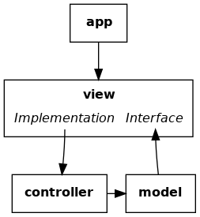
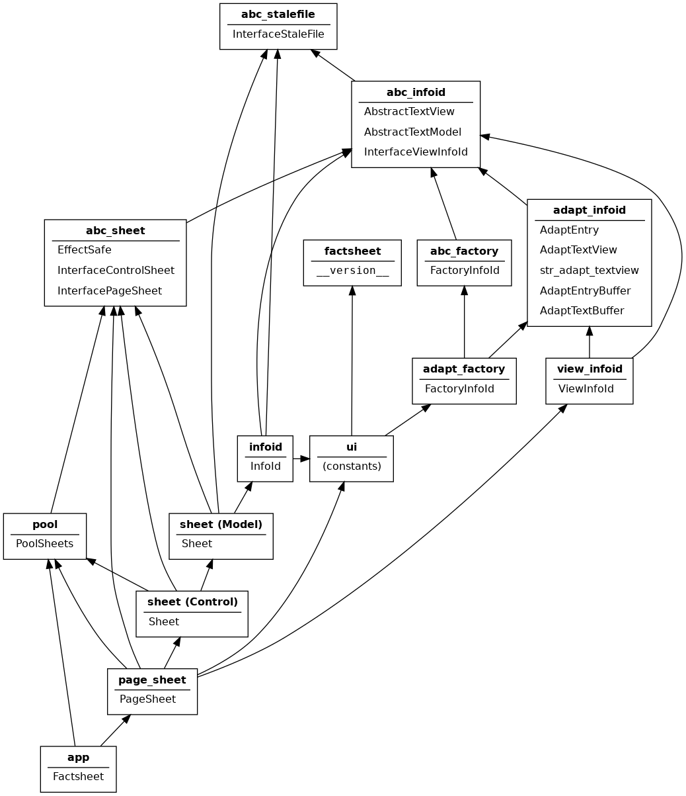

Development Notes
=================

The Factsheet application evolves by exploration, review, and
refactoring.  These notes record development decisions made as the
project progresses.  The notes include some lessons learned along the
way.  *Caveat emptor:* the notes are a work in progress and not
comprehensive.

Purpose
-------
The primary purpose of Factsheet is exploration.  First, to explore
Python and current software development tools and techniques.  Second,
to explore visualization of basic properties of small algebraic
structures (for example, sets, operations, and groups).

Beginning
---------
I am learning techniques and tools as I go.  I expect to make a lot
mistakes and encounter many dead ends.  I am working on my own.
Consequently, I need a resilient plan and feedback mechanisms to make
progress.

The plan needs to accommodate the following.

  * A graphical user interface (GUI).  The look and behavior of the
    application will change considerably over time.  The underlying
    widget toolkit may change, too.
  * Calculations and persistent data.  The core of the application
    should be independent of the GUI to the extent possible.  It should
    be as easy as possible to extend content.
  * Document and window management.  Rich visualization entails the
    capability to compare data sets and to view a single data set in
    different ways.

`Model-view-controller
<https://en.wikipedia.org/wiki/Model%E2%80%93view%E2%80%93controller>`_
presents a basic structure for an application that meets the initial
needs.  This Wikipedia page identifies variations that might be more
appropriate as development progresses.  Thus, the plan starts with the
following together with a willingness to adapt as needed.

  * **Model** -- persistent data with supporting calculations.
  * **View** -- widget toolkit display elements with supporting code.
  * **Controller** -- create, track, store, and load multiple Model
    data sets as well as multiple View windows for each data set, 

Ideally, change to any one component would have minimal effect on the
other two.  Practicallly, I expect tradeoffs would be needed.  My
emphasis will be on isolating the View, since the View is likely to
change the most.  Moreover, I have little expreience with GUI
development.

A second aspect of the initial plan is layering to further decompose the
components into more manageable pieces.  :doc:`../guide/intro` describes
the orgnaization of a factsheet document.  A factsheet contains facts
about one or more subjects.  Each fact is a statement about a specific
subject.  A topic is a collection of facts related to the same subject.
A factsheet is a collection of topics.  The initial plan partitions
model, view, and control components into factsheet, topic, and fact
layers.

Using model-view-control structure and layering adds overhead to the
project that may not be needed.  However, the primary purpose of the
application is to explore techniques and tools.  Practice will show the
benefits and costs of these techniques more clearly than simply reading
about them.

Feedback Strategies
-------------------
Working alone and learning as I go mean mistakes and changes of
direction are likely.  I use the following strategies to mimimize lost
time.

    1. Document intent
    
        Include docstrings for each module, class, method, and function
        to document purpose and intended behavior.  Automate
        documentation generation with `Sphinx <sphinx_>`_.  See
        :doc:`../src/toc_src`.

        .. _sphinx: https://www.sphinx-doc.org/en/master/

    #. Confirm behavior frequently
    
        Include unit tests for each method and function.  Basic
        test-driven development (TDD_) provides a means to continuously
        develop useful unit tests.  Implement and automate unit tests
        with pytest_.  See :doc:`../test/toc_test`.   

        .. _pytest: https://docs.pytest.org/en/latest/

        Include manual tests for compound behaviors as well as to assess
        look and feel of application interface.  See
        :doc:`../test_manual/toc_test_manual` .

        .. _TDD: https://en.wikipedia.org/wiki/Test-driven_development

    #. Check consistency and clarity
    
        Include `type hints <PEP_484_>`_ in method, function, and data
        definitions.  Check type consistency with MyPy_, which is
        supported by PyDev_ for Eclipse_.

        Check code clarity with the PyDev_'s `PEP 8 <PEP_8_>`_ style
        checker.
        
        .. _Eclipse: https://www.eclipse.org/ide/

        .. _PyDev: https://www.pydev.org/index.html

        .. _MyPy: https://mypy.readthedocs.io/en/stable/

        .. _PEP_8: https://www.python.org/dev/peps/pep-0008/

        .. _PEP_484: https://www.python.org/dev/peps/pep-0484/

    #. Localize errors
    
        Write small, coherent methods and functions.  It is easier to
        write complete, effective unit tests for a small function than
        for a large function.

    #. Foster consistency
    
        Establish and use naming and layout conventions. See **TBD**.

    #. Facilitate recovery

        Use Git_ version control to make it easier to try out ideas and
        recover from ones that do not work out.  See `Factsheet
        repository <https://github.com/gary9204/Factsheet>`_.

        .. _Git: https://git-scm.com/

Lessons Learned
---------------

Asynchronous Behavior
^^^^^^^^^^^^^^^^^^^^^
When a method evokes a GTK signal, GTK might not process the signal until
after the method completes.  This may cause unexpected behavior
especially when the method evokes the signal indirectly.

One implementation of :meth:`.ControlSheet.remove_all_views`
serves as an example.  Method :meth:`.remove_all_views`
relied on a :class:`.ViewSheet` method both to 
destroy the GTK visual element and to stop tracking the sheet view.  
The :class:`.ViewSheet` method emitted a Gtk.Window.delete-event_ signal and the
:class:`.ViewSheet` signal handler called
:meth:`.ControlSheet.remove_view` to stop tracking the sheet view.
The :class:`.ViewSheet` method returned before the signal handler called
:meth:`.remove_view` and :meth:`.remove_all_views` would enter an
infinite loop.

The fix was to replace the original method with :meth:`.ViewSheet.erase`
and to have :meth:`.remove_all_views` directly call :meth:`.remove_view`
for each view.

.. _Gtk.Window.delete-event: https://lazka.github.io/pgi-docs/#Gtk-3.0/classes/
    Widget.html#Gtk.Widget.signals.delete_event

.. warning:: The text after this point is under review. Portions of
    the text are inaccurate and incomplete.

Tradeoffs
---------

Observers
^^^^^^^^^
In general, view classes call control class methods, control classes
call model methods, and model classes call view methods.  In a few
cases, it seems appropriate for a control class to call view class
methods.  For example, when the user closes a factsheet from one view,
a control notifies all views of the factsheet to close.  This
arrangement rasise several issues.

* Circular imports
* Forward references
* Fail-safe operation
* Widget toolkit elements

Possible approaches to creating observers include the following.

* Factory
* Registration

The general flow of control is illustrated in the figure below.  A user
takes action at the view.  The view translates an action into requests to
a controller.  The controller updates the model based on the request.
The model notifies the view of changes.  Finally, the view closes the
loop by updating the presentation to the user.

.. figure:: ../images/mvc.png
   :align: center
   :alt: Relation between model, view, and control components of design.
   
   General Model-View-Control Design

In Factsheet, the control loop leads to an cycle of Python imports.
Factsheet splits the view into an abstract interface and an
implementation to break the cycle.  The model is written against the
abstract interface.  The view implementation realizes the abstract
interface.  The implementation calls on controller services.  In
addition, the application itself initiates the control loop by calling
on the view.  The figure below shows these additional details.

   Factsheet Model-View-Control Design

Initial View Implementation with GTK
------------------------------------
Two objectives for the :mod:`factsheet.view` implementation are 1)
minimize user interface work by using a robust widget toolkit and 2)
accommodate porting to more than one widget toolkit. 

For the first objective, the initial implementation of
:mod:`~factsheet.view` makes use of the `GTK widget toolkit
<Wikipedia_GTK_>`_.  GTK is commonly used for `GNOME
<Wikipedia_GNOME_>`_ applications running on Linux.  It is under active
development with periodic stable releases.  GTK is well documented
including its Python bindings.  GTK has a graphical user interface
builder, the `Glade Interface Designer <Wikipedia_Glade_>`_.

For the second objective, the Factsheet implementation minimizes the
dependencies of :mod:`~factsheet.control` and :mod:`~factsheet.model` on
GTK.  However, GTK also is based on a MVC design.  There would be
significant duplication if :mod:`~factsheet.model` did not use GTK model
components.  The duplicate code would be less effective and less
reliable.

Consequently, the Factsheet model uses GTK classes and mechanisms to
avoid duplication.  To accommodate porting, the implementation
encapsulates dependencies via abstract classes.  It uses GTK components
for the initial implementation of the abstract classes.  Doing so
mitigates coupling between :mod:`~factsheet.model` and GTK.  Subpackage
:mod:`~factsheet.abc_types` specifies abstract classes and interfaces
that the :mod:`~factsheet.model` and :mod:`~factsheet.view` share.
Subpackage :mod:`~factsheet.adapt_gtk` defines the GTK implementations
of the abstract classes.

.. _Wikipedia_Glade:
   https://en.wikipedia.org/wiki/Glade_Interface_Designer

.. _Wikipedia_GNOME:
   https://en.wikipedia.org/wiki/GNOME

.. _Wikipedia_GTK:
   https://en.wikipedia.org/wiki/GTK

.. _Wikipedia_MVC:
   https://en.wikipedia.org/wiki/Model%E2%80%93view%E2%80%93controller

Modularity
----------

Python packages and modules partition Factsheet code.  The main
partitions are packages :mod:`factsheet` and :mod:`factsheet_test`.  The
former package contains source code while the latter contains unit test
code.  Each main package has a subpackage for abstractions
(:mod:`factsheet.abc_types` and :mod:`factsheet_test.abc_types`,
respectively), model components (:mod:`factsheet.model` and
:mod:`factsheet_test.model`), view components (:mod:`factsheet.view` and
:mod:`factsheet_test.view`), and control components
(:mod:`factsheet.control` and :mod:`factsheet_test.control`).  Package
:mod:`factsheet.content` contains templates and forms for model content
with corresponding unit tests in :mod:`factsheet_test.content`.

Python modules partition related classes within each subpackage.  The
figure below contains a box representing each Factsheet module at the
application and factsheet level.

   Factsheet Modules and Imports

   Each box represents a Factsheet module. The module's name is in
   **bold**. The list below the module name consists of classes the
   module defines. An arrow points from module A to B when A imports B.

Layering
--------

:doc:`../guide/intro` describes the orgnaization of a factsheet
document.  A factsheet contains facts about one or more subjects.  Each
fact is a statement about a specific subject.  A topic is a collection
of facts related to the same subject.  A factsheet is a collection of
topics.  The design partitions classes into factsheet, topic, and fact
layers.

The user interface follows the decomposition into factsheet, topics, and
facts.  Each Factsheet window presents a factsheet document.  A window
has a collection of views with one view for each topic in the factsheet.
A window presents one topic view at a time.  A topic view has a
collection of views with one view for each fact in the topic.  A topic
view presents one fact view at a time.  A user may open more than one
window for a factsheet to see multiple topics and facts simultaneously.

Similarly, the model decomposes into factsheet, topic, and fact
components.  A factsheet model contains a hierarchy of topics.  Each
topic contains a hierarchy of facts.   Factsheet, topic, and fact
controls mediate between each model component and the corresponding user
interface component.
