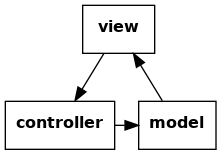

Development Notes
=================

The Factsheet application evolves by exploration, review, and
refactoring.  These notes record design and implementation decisions
made as the project progresses.  The notes include some lessons learned
along the way.  *Caveat emptor:* the notes are a work in progress and
not comprehensive.

Purpose
-------
The primary purpose of Factsheet is exploration.  First, to explore
Python and current software development tools and techniques.  Second,
to explore visualization of basic properties of small algebraic
structures (for example, sets, operations, and groups.

Overall Design
--------------
Factsheet is based on a model-view-controller pattern.  For an overview
of the pattern, see Wikipedia page `Model-view-controller
<https://en.wikipedia.org/wiki/Model%E2%80%93view%E2%80%93controller>`_.

The general flow of control is illustrated in the figure below.  A user
takes action at the view.  The view translates an action into requests to
a controller.  The controller updates the model based on the request.
The model notifies the view of changes.  Finally, the view closes the
loop by updating the presentation to the user.

   
   General Model-View-Control Design

In Factsheet, the control loop leads to an cycle of Python imports.
Factsheet splits the view into an abstract interface and an
implementation to break the cycle.  The model is written against the
abstract interface.  The view implementation realizes the abstract
interface.  The implementation calls on controller services.  In
addition, the application itself initiates the control loop by calling
on the view.  The figure below shows these additional details.

   Factsheet Model-View-Control Design

Initial View Implementation with GTK
------------------------------------
Two objectives for the :mod:`factsheet.view` implementation are 1)
minimize user interface work by using a robust widget toolkit and 2)
accommodate porting to more than one widget toolkit. 

For the first objective, the initial implementation of
:mod:`~factsheet.view` makes use of the `GTK widget toolkit
<Wikipedia_GTK_>`_.  GTK is commonly used for `GNOME
<Wikipedia_GNOME_>`_ applications running on Linux.  It is under active
development with periodic stable releases.  GTK is well documented
including its Python bindings.  GTK has a graphical user interface
builder, the `Glade Interface Designer <Wikipedia_Glade_>`_.

For the second objective, the Factsheet implementation minimizes the
dependencies of :mod:`~factsheet.control` and :mod:`~factsheet.model` on
GTK.  However, GTK also is based on a MVC design.  There would be
significant duplication if :mod:`~factsheet.model` did not use GTK model
components.  The duplicate code would be less effective and less
reliable.

Consequently, the Factsheet model uses GTK classes and mechanisms to
avoid duplication.  To accommodate porting, the implementation
encapsulates dependencies via abstract classes.  It uses GTK components
for the initial implementation of the abstract classes.  Doing so
mitigates coupling between :mod:`~factsheet.model` and GTK.  Subpackage
:mod:`~factsheet.abc_types` specifies abstract classes and interfaces
that the :mod:`~factsheet.model` and :mod:`~factsheet.view` share.
Subpackage :mod:`~factsheet.adapt_gtk` defines the GTK implementations
of the abstract classes.

.. _Wikipedia_Glade:
   https://en.wikipedia.org/wiki/Glade_Interface_Designer

.. _Wikipedia_GNOME:
   https://en.wikipedia.org/wiki/GNOME

.. _Wikipedia_GTK:
   https://en.wikipedia.org/wiki/GTK

.. _Wikipedia_MVC:
   https://en.wikipedia.org/wiki/Model%E2%80%93view%E2%80%93controller

Modularity
----------

Python packages and modules partition Factsheet code.  The main
partitions are packages :mod:`factsheet` and :mod:`factsheet_test`.  The
former package contains source code while the latter contains unit test
code.  Each main package has a subpackage for abstractions
(:mod:`factsheet.abc_types` and :mod:`factsheet_test.abc_types`,
respectively), model components (:mod:`factsheet.model` and
:mod:`factsheet_test.model`), view components (:mod:`factsheet.view` and
:mod:`factsheet_test.view`), and control components
(:mod:`factsheet.control` and :mod:`factsheet_test.control`).  Package
:mod:`factsheet.content` contains templates and forms for model content
with corresponding unit tests in :mod:`factsheet_test.content`.

Python modules partition related classes within each subpackage.  The
figure below contains a box representing each Factsheet module at the
application and factsheet level.

.. figure:: ../images/imports.png
   :align: center
   :alt: Factsheet modules, classes, and imports.

   Factsheet Modules and Imports

   Each box represents a Factsheet module. The module's name is in
   **bold**. The list below the module name consists of classes the
   module defines. An arrow points from module A to B when A imports B.

